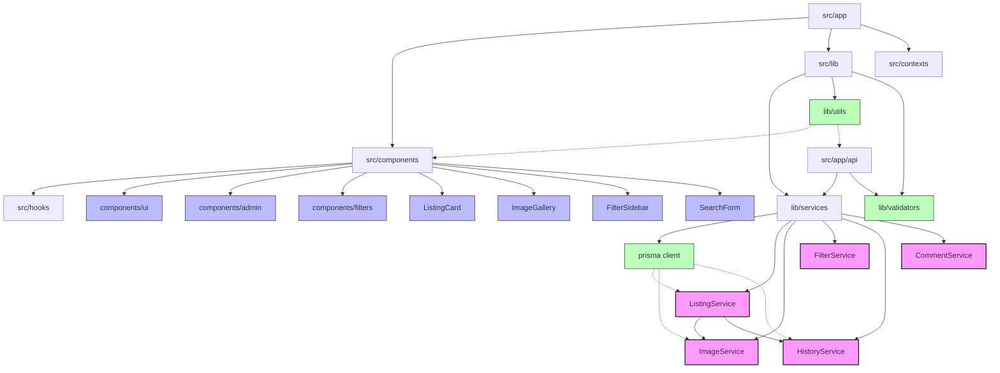
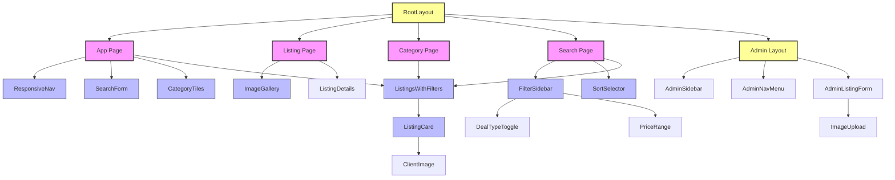

# Real Estate Website Codebase Overview

This document provides a comprehensive visualization and analysis of the real estate website codebase structure, dependencies, and architecture.

## 1. Project Context & Scope

### Technology Stack
- **Frontend**: Next.js 15.3.0 with React 19, TypeScript
- **Backend**: Next.js API routes (serverless functions)
- **Database**: PostgreSQL via Prisma ORM
- **State Management**: React Query, SWR
- **Styling**: Tailwind CSS 4
- **Auth**: Custom JWT implementation
- **Image Storage**: File system with Vercel Blob
- **Deployment**: Vercel (implied by configuration)

### Core Features
- Property listings management
- User authentication and authorization
- Admin dashboard for content management
- Advanced search and filtering
- Image upload and gallery management
- Listing history and audit trails
- Multi-category support (apartments, houses, land, commercial)

## 2. Directory & Module Structure

### Hierarchical Directory Tree (Annotated)

```
realty-website
├── src/                          # Main source code directory
│   ├── app/                      # Next.js App Router pages (actual pages)
│   │   ├── (auth)/               # Auth-related pages (authentication routes)
│   │   ├── admin/                # Admin dashboard pages
│   │   │   ├── listings/         # Listing management (CRUD operations)
│   │   │   └── users/            # User management
│   │   ├── api/                  # API routes (backend - endpoints that return data, not visual pages)
│   │   │   ├── admin/            # Admin-only API endpoints
│   │   │   ├── auth/             # Authentication endpoints
│   │   │   ├── listings/         # Listing CRUD operations
│   │   │   └── system/           # System health and monitoring
│   │   ├── listing/              # Public listing detail pages
│   │   ├── listing-category/     # Category listing pages
│   │   └── search/               # Search results pages
│   ├── components/               # Reusable React components
│   │   ├── admin/                # Admin-specific components
│   │   ├── filters/              # Search filter components
│   │   ├── ui/                   # Generic UI components
│   │   └── monitoring/           # System monitoring components
│   ├── lib/                      # Utilities and services
│   │   ├── actions/              # Server actions
│   │   ├── services/             # Business logic services
│   │   ├── utils/                # Utility functions
│   │   └── validators/           # Data validation functions
│   ├── contexts/                 # React contexts (a way to share data between many components without having to pass it down manually through props at every level)
│   ├── hooks/                    # Custom React hooks (reusable functions that let you use React features without writing a full component)
│   └── types/                    # TypeScript type definitions
├── prisma/                       # Prisma ORM configuration and migrations
│   ├── migrations/               # Database migrations (5 migration files)
│   └── schema.prisma             # Database schema definition
├── public/                       # Static assets
├── scripts/                      # Build and utility scripts
└── [configuration files]         # Various config files
```

### Key Observations
- **Next.js App Router**: Modern organization with route groups and folders
- **API Routes**: Co-located with page structure, following RESTful conventions
- **Service Layer**: Well-defined services encapsulating business logic
- **Component Organization**: Mix of feature-based and generic UI components
- **Prisma Migrations**: Active schema evolution (7 migrations)

## 3. Dependency Graph

### Top External Dependencies
1. **next**: ^15.3.0 - Framework (routing, SSR, API)
2. **react/react-dom**: ^19.0.0 - UI library
3. **@prisma/client**: ^6.6.0 - Database ORM
4. **@tanstack/react-query**: ^5.74.4 - Data fetching/caching
5. **zod**: ^3.24.3 - Schema validation
6. **bcrypt**: ^5.1.1 - Password hashing
7. **jsonwebtoken**: ^9.0.2 - Authentication
8. **@vercel/blob**: ^1.0.0 - Image storage
9. **framer-motion**: ^12.9.1 - Animations
10. **sharp**: ^0.34.1 - Image optimization

### Module Import Graph



### Circular Dependencies
No obvious circular dependencies were detected in the examined codebase. The service layer has a clean hierachy with ListingService as a central service that depends on ImageService and HistoryService.

## 4. Component Hierarchy

### React Component Hierarchy



## 5. API Route Map

### API Endpoints

| Method | Path | Description | Middleware | Response |
|--------|------|-------------|------------|----------|
| GET | /api/listings | List all listings with filtering | - | Paginated listings |
| GET | /api/listings/[id] | Get single listing details | - | Listing details |
| GET | /api/listings/suggestions | Get similar listings | - | List of listings |
| POST | /api/admin/listings | Create new listing | isAuthenticated | Created listing |
| PUT | /api/admin/listings/[id] | Update listing | isAuthenticated | Updated listing |
| DELETE | /api/admin/listings/[id] | Delete listing | isAuthenticated | Success status |
| POST | /api/admin/listings/[id]/history | Get listing history | isAuthenticated | History entries |
| POST | /api/auth/login | User login | validateLoginInput | User + JWT token |
| POST | /api/auth/logout | User logout | isAuthenticated | Success status |
| GET | /api/auth/check | Check authentication | - | Auth status |
| GET | /api/categories | List all categories | - | Categories list |
| GET | /api/districts | List all districts | - | Districts list |
| GET | /api/filter-options | Get filter options | - | Filter metadata |
| GET | /api/admin/users | List all users | isAuthenticated + isAdmin | Users list |
| POST | /api/admin/users/upload-photo | Upload user photo | isAuthenticated + isAdmin | Photo URL |
| GET | /api/system/health | Check system health | - | Health status |
| GET | /api/image/[...path] | Get optimized image | - | Image stream |

## 6. Data Model / ER Diagram

### Entity-Relationship Diagram

```mermaid
erDiagram
    User {
        string id PK
        string name
        string username UK
        string password
        string phone NULL
        string photo NULL
        datetime createdAt
        datetime updatedAt
    }
    
    Category {
        string id PK
        string name
        string slug UK
        string description NULL
    }
    
    Listing {
        string id PK
        string title
        string publicDescription NULL
        string adminComment NULL
        string categoryId FK
        string userId FK
        string district NULL
        string address NULL
        int rooms NULL
        float houseArea NULL
        float kitchenArea NULL
        float landArea NULL
        int floor NULL
        int totalFloors NULL
        string condition NULL
        int yearBuilt NULL
        enum buildingType NULL
        enum balconyType NULL
        enum bathroomType NULL
        enum windowsView NULL
        boolean noEncumbrances
        boolean noShares
        float price
        string currency
        enum dealType
        datetime dateAdded
        string listingCode UK
        string status
    }
    
    Image {
        string id PK
        string listingId FK
        string path
        boolean isFeatured
    }
    
    Comment {
        string id PK
        string listingId FK
        string content
        datetime createdAt
        datetime updatedAt
    }
    
    ListingHistory {
        string id PK
        string listingId FK
        string userId FK
        json changes
        datetime createdAt
        string action
    }
    
    User ||--o{ Listing : "creates"
    User ||--o{ ListingHistory : "creates"
    Category ||--o{ Listing : "categorizes"
    Listing ||--o{ Image : "has"
    Listing ||--o{ Comment : "has"
    Listing ||--o{ ListingHistory : "has"
```

## 7. Insights & Recommendations

### Architecture Analysis

#### Strengths
- **Clean Service Layer**: Well-organized business logic in services
- **Type Safety**: Comprehensive TypeScript usage throughout codebase
- **Modular Components**: Good separation of concerns in UI components
- **Data Validation**: Consistent use of validation for user inputs
- **History Tracking**: Robust audit trail for listing changes
- **Image Management**: Efficient handling of property images

#### Hotspots
- **ListingService.ts (687 lines)**: Too large, could be split into sub-services
- **FilterService.ts (424 lines)**: Complex filtering logic could be refactored
- **HistoryService.ts (301 lines)**: History tracking could be abstracted further
- **SearchForm.tsx (315 lines)**: Should be broken down into smaller components
- **ListingHistory.tsx (427 lines)**: UI component is too large and complex

### Refactoring Recommendations

1. **Split Service Classes**:
   - Divide ListingService into ListingCrudService, ListingFilterService, and ListingImageService
   - Extract common logic from services into BaseService

2. **Optimize Component Structure**:
   - Break down large components (SearchForm, ListingHistory)
   - Create more reusable smaller components
   - Consider using compound components pattern for related UI elements

3. **Improve State Management**:
   - Consider using React Context more extensively for sharing state
   - Add more custom hooks to encapsulate common logic

4. **Enhance API Organization**:
   - Group related endpoints under versioned APIs
   - Add consistent error handling middleware

5. **Database Optimizations**:
   - Add indexes for frequently queried fields (district, price)
   - Consider adding database-level constraints for data integrity

## 8. Next Steps

### Tooling Suggestions

1. **Dependency Analysis**:
   - Install `madge` to visualize JavaScript dependencies
   - Run `npx madge --image graph.png src/` to generate dependency graph

2. **Diagram Generation**:
   - Use `mermaid-cli` for rendering diagrams from code
   - Install VSCode Mermaid extension for live preview

3. **Performance Monitoring**:
   - Add Lighthouse CI to measure performance metrics
   - Implement server-side monitoring with Prometheus or Datadog

4. **Type Safety**:
   - Run `typescript-strict-plugin` to enforce stricter type checks
   - Add Prisma's generated types to ensure DB type safety

### Conclusion

The Real Estate Website codebase demonstrates a well-organized modern Next.js application with a clean architecture. The primary complexity lies in the filtering and listing management logic, which could benefit from further modularization. The application follows good practices for authentication, data validation, and image handling.

The codebase shows thoughtful organization with features grouped logically. The separation between public-facing and admin functionality is clear. With some refactoring of larger files and enhanced state management, the codebase can become even more maintainable and scalable. 